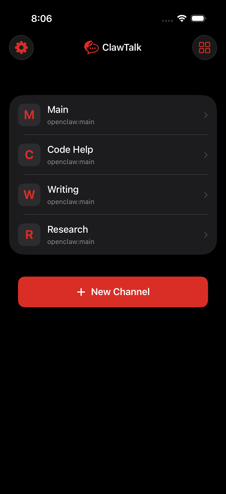
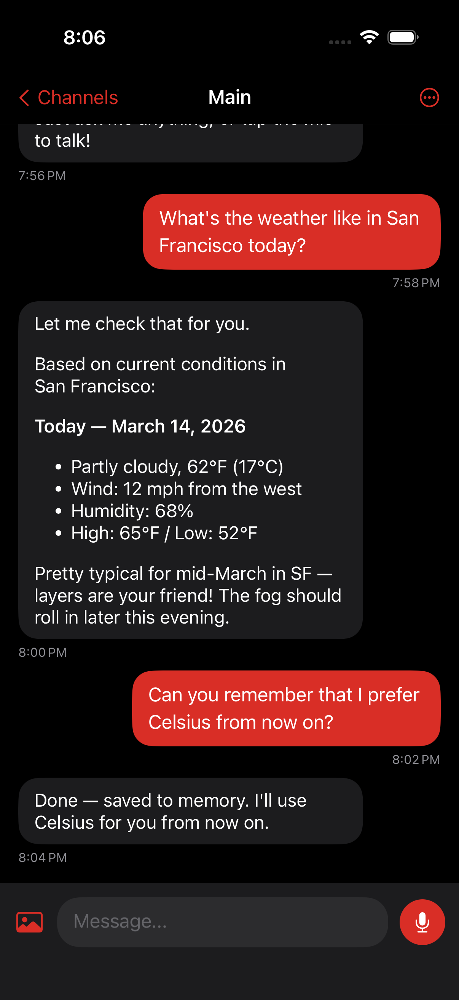
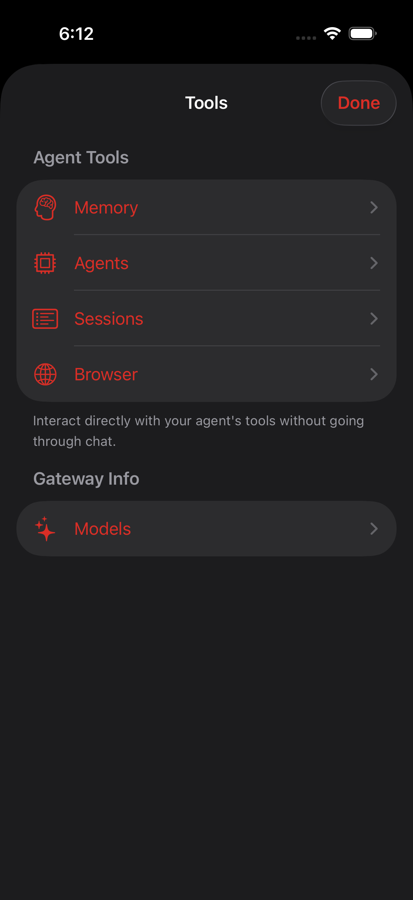

<p align="center">
  
</p>

<h1 align="center">ClawTalk</h1>

<p align="center">
  A native iOS app for voice and text chat with your <a href="https://github.com/openclaw/openclaw">OpenClaw</a> agents.
</p>

<p align="center">
  Push-to-talk or hands-free conversation mode with on-device speech recognition, streaming text responses with markdown rendering, text-to-speech output, image sending, and multi-agent channels — all over a secure HTTPS connection to your self-hosted OpenClaw gateway.
</p>

## Features

- **Voice input** — Push-to-talk or hands-free conversation mode with Voice Activity Detection
- **On-device speech-to-text** — WhisperKit runs entirely on your phone. Audio never leaves the device.
- **Streaming responses** — Text streams in real-time as your agent generates it
- **Text-to-speech** — Responses are spoken aloud. Choose from ElevenLabs, OpenAI, or Apple's built-in voice.
- **Image sending** — Attach up to 8 photos per message
- **Multi-agent channels** — Create channels for different OpenClaw agents
- **Markdown rendering** — Agent responses render with full markdown support
- **Token usage** — See input/output token counts per message (Open Responses API)
- **Dark mode** — Designed for dark mode with OpenClaw lobster branding
- **Security first** — All credentials in iOS Keychain, HTTPS enforced, on-device STT

<p align="center">
  
  
  
</p>

## Install

ClawTalk is currently under review for the App Store. Once approved, you'll be able to install it directly from there.

In the meantime, you can build it from source — see below.

## Requirements

- iOS 17.0+
- Xcode 16.0+ with Swift 5.10
- [xcodegen](https://github.com/yonaskolb/XcodeGen) — generates the Xcode project from `project.yml`
- A running [OpenClaw](https://github.com/openclaw/openclaw) instance with the HTTP API enabled

## Building

### 1. Install dependencies

```bash
brew install xcodegen
```

### 2. Generate the Xcode project

```bash
cd clawtalk-ios
xcodegen generate
```

This reads `project.yml` and generates `ClawTalk.xcodeproj`. Run this again any time you add or remove source files.

### 3. Open and build

```bash
open ClawTalk.xcodeproj
```

Or build from the command line:

```bash
xcodebuild -project ClawTalk.xcodeproj \
  -scheme ClawTalk \
  -destination 'platform=iOS Simulator,name=iPhone 16 Pro' \
  build
```

Swift Package Manager dependencies (WhisperKit, KeychainAccess, MarkdownUI) resolve automatically on first build.

### 4. Run on device

To run on a physical device, update the development team in `project.yml`:

```yaml
settings:
  base:
    DEVELOPMENT_TEAM: YOUR_TEAM_ID
```

Then regenerate: `xcodegen generate`

## OpenClaw Gateway Setup

ClawTalk connects to your self-hosted OpenClaw instance over HTTPS. You need to:

1. **Enable the HTTP API** in your OpenClaw config
2. **Expose it securely** via Cloudflare Tunnel or Tailscale

### Enable Chat Completions (minimum)

Edit your OpenClaw config (`~/.openclaw/config.json`):

```json
{
  "gateway": {
    "http": {
      "endpoints": {
        "chatCompletions": {
          "enabled": true
        }
      }
    }
  }
}
```

### Enable Open Responses (optional, for token usage)

```json
{
  "gateway": {
    "http": {
      "endpoints": {
        "chatCompletions": {
          "enabled": true
        },
        "responses": {
          "enabled": true
        }
      }
    }
  }
}
```

The Open Responses API provides real token usage data (input/output counts) and structured streaming events. Chat Completions is the simpler default that works with all gateways.

### Set a gateway token

```bash
export OPENCLAW_GATEWAY_TOKEN="your-secure-random-token"
```

You'll enter this same token in the app's Settings.

### Expose securely

**Tailscale (recommended):** Install [Tailscale](https://tailscale.com/download) on your server and iPhone, then use Tailscale Serve:

```bash
tailscale serve https / http://127.0.0.1:18789
```

Your gateway is now at `https://<hostname>.your-tailnet.ts.net`.

**Cloudflare Tunnel:** Alternative if you want a public-facing URL without installing Tailscale on your phone.

See [docs/server-setup.md](docs/server-setup.md) for detailed step-by-step instructions for both options.

### Verify

```bash
curl -X POST https://your-gateway-url/v1/chat/completions \
  -H "Authorization: Bearer YOUR_TOKEN" \
  -H "Content-Type: application/json" \
  -d '{"model":"openclaw:main","messages":[{"role":"user","content":"Hello!"}],"stream":false}'
```

### WebSocket Mode (optional)

ClawTalk defaults to HTTP, which works out of the box. WebSocket mode is an optional upgrade that adds:

- **Model selection** — browse and pick from all models configured on your gateway
- **Chat abort** — cancel in-progress agent responses
- **Real-time events** — lower-latency streaming via push events

WebSocket mode does **not** currently support model name display or token usage in responses (these are gateway-side limitations).

#### Enabling WebSocket

1. Enable WebSocket Mode in **Settings → OpenClaw Gateway**
2. Set the **WS Port or Path**:
   - **Tunneled connections** (Cloudflare, ngrok): Enter a path, e.g. `/ws`
   - **Local/Tailscale connections**: Enter the WebSocket port, e.g. `18789`

#### Device pairing (remote connections only)

When connecting via WebSocket over the internet (Cloudflare Tunnel, public URL), your device must be approved on the gateway before it can connect. Local and Tailscale connections auto-approve.

1. Open ClawTalk and enable WebSocket mode — the app will attempt to connect
2. On your gateway machine, list pending devices:

```bash
openclaw devices list
```

You should see your device with status `pending`. Pairing requests expire after **5 minutes**.

3. Approve the device:

```bash
openclaw devices approve <device-id>
```

4. ClawTalk will automatically reconnect once approved. You only need to do this once per device.

If the connection fails with a timeout, double-check:
- Your gateway URL is correct
- The WS path matches your tunnel config (e.g., `/ws` for Cloudflare)
- The device pairing was approved before the 5-minute expiry

## App Configuration

On first launch, the onboarding wizard walks you through gateway setup and voice configuration. Everything can be changed later in Settings.

1. **Settings → OpenClaw Gateway**
   - **URL**: Your gateway URL (e.g., `https://openclaw.yourdomain.com`)
   - **Token**: Your gateway token
   - **API Mode**: Chat Completions (default) or Open Responses
   - **WebSocket Mode**: Off by default. Enable for model selection and chat abort.

2. **Settings → Text-to-Speech** (optional)
   - **ElevenLabs**: Best quality. Enter your API key and voice ID.
   - **OpenAI**: Good quality, cost-effective. Enter your API key.
   - **Apple**: Free, offline. No setup needed.

3. **Settings → Speech-to-Text**
   - **Small** (250 MB): Faster, good for most use. Downloaded on first voice input.
   - **Large Turbo** (1.6 GB): Best accuracy. Download prompted with confirmation.

4. **Settings → Voice**
   - Toggle voice input and output independently for text-only mode.

5. **Settings → Display**
   - Toggle token usage display under assistant messages (requires Open Responses API, HTTP mode only).

## Tools Dashboard

The wrench icon on the channel list opens the **Tools** view — a dashboard for interacting directly with your agent's internals without going through chat.

| Tool | What it does |
|------|-------------|
| **Memory** | Search and read your agent's memory files |
| **Agents** | View available agents on your gateway |
| **Sessions** | List active sessions, view status and conversation history |
| **Browser** | View browser status, tabs, and take screenshots |
| **Files** | Read files from your agent's workspace |

Tools are automatically probed for availability on each visit. Unavailable tools appear greyed out with "Not enabled on gateway".

### Enabling tools on the gateway

Tools require specific **tool profiles** on your agents. In `~/.openclaw/openclaw.json`:

```json
{
  "agents": {
    "list": [{
      "id": "main",
      "tools": {
        "profile": "coding"
      }
    }]
  }
}
```

| Profile | Tools enabled |
|---------|--------------|
| `minimal` | Session status only |
| `coding` | Filesystem, exec, sessions, memory, image |
| `messaging` | Messaging, session management |
| `full` | Everything |

**Memory tools** additionally require an embedding provider configured under `plugins.slots.memory`.

**File read** requires the `coding` profile or explicit `tools.alsoAllow: ["read"]`.

## Multi-Agent Channels

Each channel routes to a specific OpenClaw agent:

1. Tap **+** on the channel list
2. Select an agent from the list, or type an agent ID manually
3. Each channel maintains its own conversation history

The agent ID maps to `"openclaw:<agentId>"` in the model field. Your OpenClaw instance routes the request to the corresponding agent.

### Agent picker visibility

The "New Channel" agent picker uses the `agents_list` tool, which is scoped by the calling agent's `subagents.allowAgents` config. To see all your agents in the picker, add to your main agent's config:

```json
{
  "agents": {
    "list": [{
      "id": "main",
      "subagents": {
        "allowAgents": ["*"]
      }
    }]
  }
}
```

Without this, only the calling agent and explicitly allowlisted agents appear. You can always type any agent ID manually using the text field.

### Creating agents

Agents are defined in `~/.openclaw/openclaw.json` under `agents.list`. Each agent has:
- **`id`**: Stable identifier (e.g., `main`, `coder`, `research`)
- **`workspace`**: Directory with agent context files (`SOUL.md`, `AGENTS.md`)
- **`tools.profile`**: What the agent can do (`minimal`, `coding`, `messaging`, `full`)

The agent's personality comes from `SOUL.md` in its workspace directory.

## Project Structure

```
ClawTalk/
  App/            # Entry point, service wiring, theme
  Core/
    Agent/        # OpenClaw HTTP client (Chat Completions + Open Responses + Tools)
    Audio/        # Mic capture (AVAudioEngine) + streaming playback
    STT/          # On-device WhisperKit + OpenAI fallback
    TTS/          # ElevenLabs, OpenAI, Apple speech services
    Security/     # iOS Keychain wrapper
    Storage/      # Channel + conversation persistence
  Features/
    Channels/     # Channel list + creation UI (agent picker)
    Chat/         # Chat view, message bubbles, talk button
    Settings/     # All configuration UI
    Setup/        # WhisperKit model download
    Tools/        # Direct tool invocation dashboard
  Models/         # Data models (Message, Channel, AppSettings, ToolTypes, API types)
```

See [ARCHITECTURE.md](ARCHITECTURE.md) for detailed architecture documentation.

## Dependencies

| Package | Purpose |
|---------|---------|
| [WhisperKit](https://github.com/argmaxinc/WhisperKit) | On-device speech-to-text (Apple Neural Engine) |
| [KeychainAccess](https://github.com/kishikawakatsumi/KeychainAccess) | Secure credential storage |
| [MarkdownUI](https://github.com/gonzalezreal/swift-markdown-ui) | Markdown rendering in chat bubbles |

## Gateway Setup Gotchas

A consolidated list of things that can trip you up when configuring the OpenClaw gateway for ClawTalk. We hit every one of these during development.

### Config file format

The OpenClaw config file is at `~/.openclaw/openclaw.json` (JSON5 format). All the snippets below show fragments — merge them into your existing config, don't replace the whole file.

### Tools show "Not enabled on gateway"

Each tool requires the right **tool profile** on your agent. The most common fix:

```json
{
  "agents": {
    "list": [{
      "id": "main",
      "tools": {
        "profile": "coding"
      }
    }]
  }
}
```

But some tools have additional requirements:

| Tool | Requirement |
|------|------------|
| Memory Search / Memory Get | Needs `plugins.slots.memory` with an embedding provider configured |
| File Read | Needs `coding` profile, or explicit `tools.alsoAllow: ["read"]` |
| Browser | Needs browser to be running on the agent's machine |
| Sessions | Works with `coding` or `full` profile |

### Agent picker only shows one agent

The `agents_list` tool is **scoped by the calling agent's subagent allowlist**. By default, an agent can only see itself. To see all agents:

```json
{
  "agents": {
    "list": [{
      "id": "main",
      "subagents": {
        "allowAgents": ["*"]
      }
    }]
  }
}
```

Without this, you can still type any agent ID manually in the text field below the picker.

### Sessions list doesn't show ClawTalk sessions

This is a known limitation for both HTTP and WebSocket modes. The gateway's `chat.send` (WebSocket) and HTTP API endpoints do **not persist sessions** to the session store. Only auto-reply channel flows (Telegram, Discord, etc.) call `resolveSessionStoreEntry()` to persist sessions. ClawTalk sends full conversation history with each HTTP request as a workaround. See [docs/TODO.md](docs/TODO.md) for the planned gateway PR to fix this.

### Agent doesn't have personality / doesn't know its name

SOUL.md is loaded at the agent level, not per-session. The agent's personality should work in both HTTP and WebSocket modes. If the agent responds as a generic assistant, check that the agent has a `workspace` configured with a `SOUL.md` file.

### WebSocket won't connect (remote)

Remote WebSocket connections require **device pairing**. See [WebSocket Mode → Device pairing](#device-pairing-remote-connections-only) above. Common issues:

- **Challenge timeout**: Wrong WS path. Use `/ws` for Cloudflare tunnels, `18789` for local connections.
- **"pairing required" error**: Device not approved. Run `openclaw devices list` and `openclaw devices approve <id>`.
- **Pairing request expired**: Requests expire after 5 minutes. Toggle WebSocket off/on in Settings to trigger a new request, then approve quickly.
- **Client ID rejected**: ClawTalk uses client ID `openclaw-ios`. If you see a schema validation error, ensure your gateway is up to date.

### WebSocket doesn't show model name or token usage

This is a gateway-side limitation. WebSocket chat events include message content and stop reason, but do **not** include the model name or token usage data. These are only available via HTTP (Chat Completions includes model name; Open Responses includes both model name and token counts). Token usage display is automatically disabled when WebSocket mode is enabled.

### Config changes not taking effect

The gateway caches config with a short TTL. After editing `openclaw.json`:
- Changes are usually picked up within seconds on the next API call
- If not, restart the gateway process
- No need to restart for agent config changes (agents, tools, profiles)

### Tool profiles reference

| Profile | What it enables |
|---------|----------------|
| `minimal` | Session status only |
| `coding` | Filesystem (read/write/edit), runtime (exec/process), sessions, memory, image |
| `messaging` | Messaging, session list/history/send, session status |
| `full` | All built-in tools (no restriction) |

You can also fine-tune with `tools.alsoAllow` and `tools.alsoDeny` arrays for individual tool names or groups (`group:fs`, `group:runtime`, `group:memory`, `group:web`, `group:ui`, `group:sessions`).

### Example complete agent config

Here's a working config that enables all ClawTalk features:

```json
{
  "gateway": {
    "http": {
      "endpoints": {
        "chatCompletions": { "enabled": true },
        "responses": { "enabled": true }
      }
    }
  },
  "agents": {
    "list": [{
      "id": "main",
      "workspace": "~/.openclaw/workspace",
      "tools": {
        "profile": "coding"
      },
      "subagents": {
        "allowAgents": ["*"]
      }
    }]
  }
}
```

The `/tools/invoke` endpoint is always available when the HTTP API is enabled — no separate config needed.

For memory tools, you'll additionally need an embedding provider under `plugins.slots.memory` — see the OpenClaw docs for embedding configuration.

## Security

- **Credentials** stored in iOS Keychain (encrypted by Secure Enclave)
- **HTTPS enforced** — the app rejects plain HTTP connections
- **On-device STT** — audio is transcribed locally, never sent to any server
- **Chat history** stored locally with iOS Data Protection (encrypted at rest)
- **No open ports** — Cloudflare Tunnel / Tailscale handles secure access
- **TLS 1.2 minimum** enforced on all network connections

<p align="center">
  
</p>

## License

MIT
